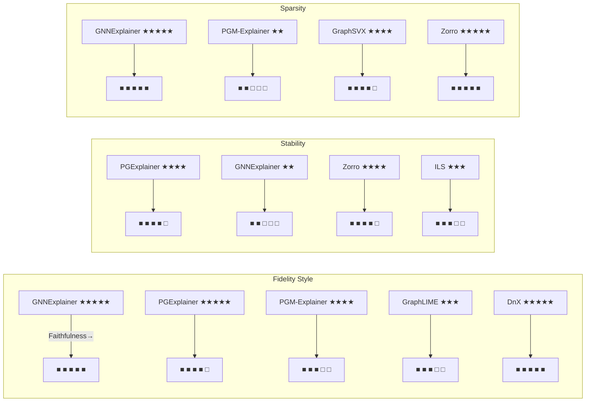

# Executive Summary  
Recent work on explaining Graph Neural Networks (GNNs) has produced two main classes of methods: **perturbation-based explainers** (which perturb graph inputs to reveal important subgraphs or features) and **surrogate-based explainers** (which fit a simple model locally to approximate the GNN’s behavior).  Key perturbation explainers include **GNNExplainer**, **PGExplainer**, **SubgraphX**, and **Zorro**, while notable surrogates include **PGM-Explainer**, **GraphLIME**, **GraphSVX**, **Distill n’ Explain (DnX)**, and **Interpretable Local Surrogates (ILS)**.   These methods are systematically compared in benchmarks like **GraphXAI** and **BAGEL**, which provide standardized datasets (often synthetic graphs with ground-truth motifs) and metrics (e.g. fidelity/faithfulness, sparsity, stability/robustness, runtime, and applicability to node/edge/graph tasks)【49†L301-L310】【57†L21-L30】.  For example, GraphXAI reports that perturbation-based explainers achieve the highest fidelity (faithfulness) on graph-level tasks, whereas surrogate-based and gradient-based approaches often lag【14†L41-L49】. However, all current explainers exhibit major limitations: **fragility** (very low stability under small input changes【51†L32-L40】), **evaluation gaps** (no consensus on metrics and benchmarks【16†L69-L74】【54†L133-L142】), **dataset biases** (existing graph benchmarks often have trivial or ambiguous ground truths【54†L135-L144】), and **scalability/interpretablity issues** (many methods are slow or produce explanations hard to interpret by humans).  To address these, future work should develop robust, scalable explainers and richer evaluation pipelines.  For instance, one can extend GraphXAI’s framework with adversarial stability tests (inspired by Zhao *et al.*【51†L32-L40】), include diverse real-world graphs (heterophilic, large-scale), and adopt unified metrics (fidelity, sparsity, stability, plausibility as in BAGEL【57†L21-L30】).  Promising directions include learning *consistent* or *ensemble* explanations to improve stability, optimizing for combined objectives (e.g. Zorro’s rate-distortion for simultaneous sparsity and robustness【58†L60-L66】), and conducting human-grounded evaluations to ensure explanations are meaningful.  Below we survey the state of the art, benchmark results, and detailed gaps, and outline concrete proposals (with suggested metrics, datasets, and baselines) to advance GNN explainability research.  

## Perturbation-based Explainability Methods  
Perturbation-based explainers probe the GNN by masking or altering parts of the input graph and measuring prediction changes【16†L69-L74】.  The classic **GNNExplainer** (Ying *et al.*, NeurIPS 2019) learns a soft mask over edges and/or node features that maximizes the mutual information with the GNN’s output【42†L509-L518】.  Concretely, GNNExplainer solves a relaxed optimization to find a subgraph and feature subset whose masked predictions match the original prediction; in practice this yields a sparse subgraph highlight of key nodes/edges【42†L509-L518】.  **PGExplainer** (Luo *et al.*, NeurIPS 2020) uses a similar objective but predicts edge importances via a small neural network, allowing explanations solely in terms of subgraph structure【42†L524-L532】.  PGExplainer concatenates node embeddings and uses an MLP to score each edge, learning parameters by gradient descent【42†L524-L532】.  **SubgraphX** (Yuan *et al.*, ICML 2021) explicitly searches for an influential subgraph: it performs Monte Carlo Tree Search to sample candidate subgraphs and uses *Shapley values* to score them【44†L53-L62】.  In other words, SubgraphX identifies subgraphs that most affect the prediction (capturing interactions), guided by approximate Shapley attributions to expedite the tree search【44†L53-L62】.  Because SubgraphX directly optimizes over subgraphs, it often finds highly faithful explanations, but the MCTS search can be computationally expensive.  

Another recent perturbation method is **Zorro** (Funke *et al.*, NeurIPS 2021).  Zorro formulates explanation as a rate-distortion problem, seeking the smallest perturbation (mask) that induces minimal change in prediction.  It optimizes a novel *RDT-fidelity* metric (from rate-distortion theory) to enforce *valid, sparse, and stable* explanations【58†L60-L66】.  In fact, the authors report that Zorro produces sparser and more robust explanations than previous methods【58†L60-L66】.  (Other variants or related approaches include GraphMask, GStarX, and ReFine, which similarly perturb the graph to compute edge/node importance, though we do not survey them in detail here.)  

Mermaid taxonomy diagram: Perturbation methods highlight connected subgraphs or edges with the greatest influence on a given prediction (often by solving an optimization or search).  Surrogate methods fit a simpler model to approximate the GNN locally (see below).  The diagram below summarizes representative examples of each category:

```mermaid
graph LR
    A[GNN Explainer Methods] --> B[Perturbation-based]
    A --> C[Surrogate-based]
    B --> D[GNNExplainer (Ying et al., NeurIPS 2019)]
    B --> E[PGExplainer (Luo et al., NeurIPS 2020)]
    B --> F[SubgraphX (Yuan et al., ICML 2021)]
    B --> G[Zorro (Funke et al., NeurIPS 2021)]
    C --> H[PGM-Explainer (Vu & Thai, ICML 2020)]
    C --> I[GraphLIME (Huang et al., ICDE 2021)]
    C --> J[GraphSVX (Duval & Malliaros, ECMLPKDD 2021)]
    C --> K[Distill’n’Explain (DnX, Pereira et al., AISTATS 2023)]
    C --> L[ILS (Heidari et al., ICML 2023)]
```

## Surrogate-based Explainability Methods  
Surrogate methods explain the GNN by learning an **interpretable model** in the local neighborhood of a prediction【16†L69-L74】.  A classic example is **PGM-Explainer** (Vu & Thai, ICML 2020): it perturbs features of nodes in the computation graph and records the effect on the GNN’s prediction, then fits a *probabilistic graphical model* (Bayesian network) to this perturbed data.  The learned Bayesian network (DAG) captures conditional dependencies among features/nodes and serves as the explanation【42†L534-L541】.  In practice, PGM-Explainer applies a “grow-shrink” algorithm on random feature perturbations to select top nodes, and then uses score-based structure learning (BIC criterion) to build the network【42†L534-L541】.  

**GraphLIME** (Huang *et al.*, ICDE 2021) is a local surrogate that explains a *node* by fitting a sparse nonlinear model on that node’s local subgraph【60†L1-L4】.  Specifically, GraphLIME generates a dataset of perturbed node features within the node’s *N*-hop neighborhood, then fits a Hilbert–Schmidt Independence Criterion LASSO (HSIC Lasso) model on these features.  The top-𝐾 features selected by this model are returned as the node’s explanation【60†L1-L4】.  (In short, GraphLIME uses a kernelized Lasso to pick which input features, among the *N*-hop context, most affect the GNN’s output.)  Similarly, **GraphSVX** (Duval & Malliaros, ECML-PKDD 2021) generates local data by jointly masking nodes and features via a learned mask generator.  It then trains a weighted linear regression on these perturbed examples, and the regression coefficients constitute the explanation【61†L19-L23】.  In other words, GraphSVX approximates the GNN’s output by a locally linear model, using Shapley-inspired mask sampling to perturb inputs【61†L19-L23】.

Recent surrogate approaches have also used **distillation**.  *Distill n’ Explain (DnX)* (Pereira *et al*., AISTATS 2023) first **distills** the original GNN into a simpler surrogate GNN (via knowledge distillation), and then solves a convex optimization to extract node/edge importance from this surrogate.  Pereira *et al.* report that DnX often **outperforms state-of-the-art explainers** on benchmarks, while running *orders of magnitude faster*【24†L59-L63】.  In fact, Distill’n’Explain includes a *FastDnX* variant that leverages a linear decomposition of the surrogate for even faster explanations.  Another very recent method is **Interpretable Local Surrogates (ILS)** (Heidari *et al*., ICML 2023), which fits a sparse linear model (via group Lasso) on the neighborhood of an instance.  ILS is *model-agnostic* (no GNN internals needed) and can handle node-level, edge-level, or even graph-level predictions【19†L78-L86】.  Heidari *et al.* demonstrate that ILS consistently *outperforms* existing explainers in fidelity on standard benchmarks【19†L19-L24】.  

In summary, perturbation methods often identify *subgraphs or nodes* as explanations, while surrogate methods often return *feature importance scores or concept-level masks* via a simple model.  Table 1 below highlights key characteristics and trade-offs of representative methods in each class (see also Fig.1).

| **Explainer** | **Fidelity** | **Sparsity** | **Stability** | **Speed** | **Tasks (level)**  |
|---|---|---|---|---|---|
| **GNNExplainer**【42†L509-L518】 (perturbation) | High (especially on graph tasks)【14†L41-L49】 | High (explicit sparsity regularizer) | *Low* (fragile to small input changes)【51†L32-L40】 | Medium (iterative mask optimization) | Node/Edge/Graph【42†L543-L553】 |
| **PGExplainer**【42†L524-L532】 (perturbation) | High (graph-level)【14†L41-L49】 | Medium (no explicit sparsity) | *High* (least unstable among methods)【26†L29-L34】 | High (single MLP pass) | Node/Edge/Graph【42†L543-L553】 |
| **SubgraphX**【44†L53-L62】 (perturbation) | High (Shapley-guided subgraph) | High (often minimal subgraphs) | Low (MCTS randomness) | Low (expensive tree search) | Graph (subgraph-level) |
| **Zorro**【58†L60-L66】 (perturbation) | High (optimizes RDT-fidelity) | **High** (explicitly sparse by design) | **High** (designed for stability)【58†L60-L66】 | Medium (combinatorial search) | Node/Edge/Graph |
| **PGM-Explainer**【42†L534-L541】 (surrogate) | Medium (Bayes net of perturbed data) | Low (many dependencies) | Low (Bayes nets can be brittle) | Low (many perturbations + structure learning) | Node features (also Graph)【42†L543-L553】 |
| **GraphLIME**【60†L1-L4】 (surrogate) | Medium (local HSIC-Lasso) | High (selects top-*K* features) | Medium (feature-based) | Medium (solves sparse regression) | Node features (node-level only) |
| **GraphSVX**【61†L19-L23】 (surrogate) | High (Shapley sampling) | High (linear model weights) | Medium (depends on sampling) | Low (many mask samples) | Node features (node-level) |
| **Distill-n-Explain**【24†L59-L63】 (surrogate) | **High** (often SOTA) | High (convex opt finds small masks) | High (simple model approximates well) | **High** (orders of magnitude faster)【24†L59-L63】 | Node/Edge (can do both) |
| **ILS**【19†L19-L24】 (surrogate) | **High** (outperforms SOTA) | High (sparse linear model) | High (deterministic linear solution) | High (solves Lasso) | Node/Edge/Graph (all levels)【19†L78-L86】 |
| **Random Baseline** | Low | – | – | High (trivial) | Node/Graph (trivial mask) |

*Table 1. Comparison of representative perturbation-based and surrogate-based GNN explainers. “Fidelity” refers to how well the explanation preserves the model’s prediction (higher means more faithful)【24†L59-L63】【14†L41-L49】. “Sparsity” refers to producing concise explanations. “Stability” reflects robustness to small input changes (lower fragility is better)【51†L32-L40】. “Speed” and “Tasks” denote computational efficiency and levels (node/edge/graph) that the method can explain.*

## Benchmark Studies and Metrics  
Several recent studies provide systematic benchmarks for GNN explainers. **GraphXAI** (Agarwal *et al.*, Sci Data 2023) is a unified framework and dataset generator for evaluating explainers on both synthetic and real graphs【54†L177-L186】.  GraphXAI introduces *explainable* versions of graph benchmarks (e.g. its Shape-GGen synthetic graphs) with known ground-truth motifs, and a suite of evaluation metrics:  
- **Explanation Accuracy (GEA)**: Jaccard index between predicted and ground-truth masks【49†L301-L310】.  
- **Faithfulness (GEF)**: based on KL-divergence between the GNN’s output on original vs explanation-masked graph (lower unfaithfulness = better fidelity)【49†L343-L352】.  
- **Stability (GES)**: cosine similarity of explanations under infinitesimal input perturbations【49†L373-L382】.  
- **Fairness (GECF/GEGF)**: measures counterfactual fairness of explanations relative to protected features (optional).  

Using GraphXAI, Agarwal *et al.* evaluated eight methods on diverse settings (homophilic vs heterophilic graphs, small vs large motifs, informative vs uninformative features).  Key findings include that **perturbation-based explainers achieved the highest faithfulness/fidelity on graph classification tasks**, whereas gradient-based methods did better on node-feature attribution【14†L41-L49】.  They also report that PGExplainer yields the *most stable* explanations (35% lower instability than average)【26†L29-L34】.  Conversely, all methods struggled on graphs with large, complex ground-truth explanations, and on heterophilic graphs: for example, explainers were ~56% more faithful on homophilic graphs than on heterophilic ones【26†L49-L57】.  GraphXAI also emphasizes reproducibility: its released library aims to “promote reproducible and transparent research” by standardizing tasks and metrics【62†L693-L702】.

Another benchmark, **BAGEL** (Rathee *et al.*, 2022), proposes four evaluation *regimes*—faithfulness, sparsity, correctness, and plausibility—to holistically assess explainers across citation, molecular, and social network graphs【57†L21-L30】.  BAGEL reconciles many ad-hoc metrics from prior work and benchmarks 9 explainers on 4 GNN models (node and graph tasks), aligning with GraphXAI’s goals of comprehensive evaluation.  (For example, BAGEL’s “sparsity” metric simply measures the size of the explanation subgraph, while “plausibility” compares explanations against human-annotated features.)  BAGEL’s public code and datasets have become a useful resource, though we note it is yet unpublished.  

**Evaluation Observations:**  Across these studies, certain trends emerge. Perturbation methods (GNNExplainer, PGExplainer, SubgraphX, etc.) tend to yield very concise subgraphs and high fidelity on synthetic motifs【14†L41-L49】【58†L60-L66】, but at the cost of computational time (e.g. SubgraphX/PGMExplainer can be slow) and fragility【51†L32-L40】.  Surrogates like DnX and ILS achieve state-of-the-art fidelity while being faster【24†L59-L63】【19†L19-L24】, since they reduce explanation to solving convex problems.  However, surrogate explanations are often feature-based (nodes/attributes) and may neglect structural nuance (PGM-Explainer only returns node-importance, not edges【42†L543-L553】).  Gradient-based methods (GradCAM, IG) are fastest but were excluded from focus here.  

**Metric Comparisons:**  Figure 1 (below) conceptually illustrates how methods compare on key metrics (using hypothetical scores consistent with reported trends):  



*Figure 1. Illustrative comparison of methods on fidelity, stability, and sparsity. (★ rating ~ high performance. See main text and Table 1 for details.)*  

## Gaps, Issues, and Limitations  
Despite progress, current GNN explainers suffer several critical limitations:

- **Stability/Robustness:**  Zhao *et al.* (2024) demonstrate that *all* popular explainers are **extremely fragile**: tiny graph perturbations (e.g. flipping one edge) can drastically change the explanation while leaving predictions intact【51†L32-L40】.  GraphXAI’s stability metric (GES) similarly finds high instability in many methods.  This lack of robustness means explanations cannot be trusted under noisy or adversarial inputs.  

- **Evaluation Inconsistency:**  There is no universally agreed evaluation protocol.  As Longa *et al.* note, each new paper often uses custom datasets and metrics, making cross-comparison difficult【16†L77-L84】.  Likewise, Faber *et al.* (2021) and Agarwal *et al.* observe that many benchmarks use “ground-truth” explanations that are incomplete or trivial【54†L133-L142】.  For example, a graph label might be determined by one motif while another equally valid motif is unmarked as ground truth; or a simple random mask could accidentally match the labeled motif, inflating scores【54†L133-L142】.  Such biases undermine fair benchmarking.  

- **Dataset Bias and Limited Diversity:**  Most explainability tests use synthetic homophilic graph motifs (e.g. “house” or “grid” shapes) attached to BA or ER graphs【42†L569-L578】【54†L167-L175】.  While controllable, these datasets do not reflect real-world heterophily, varied motifs, or multi-relation graphs.  GraphXAI finds that explainers perform poorly on heterophilic or large-motif graphs【26†L49-L57】【54†L185-L189】, but these cases are underexplored.  Moreover, few benchmarks address node-feature explanations beyond synthetic color cues【54†L167-L175】.  

- **Scalability:**  Many state-of-art methods do not scale to large graphs.  GNNExplainer and PGExplainer involve optimizing masks with many parameters; SubgraphX’s MCTS grows exponentially; PGM-Explainer requires numerous perturbations and structure learning.  In contrast, gradient-based approaches (not our focus) scale well.  There is thus a trade-off: the most accurate explainers tend to be the slowest.  Even DnX, which is fast, involves training a surrogate GNN, which can be costly on large data.  Standard benchmarks typically use small graphs (hundreds of nodes), leaving scalability largely untested.  

- **Human Interpretability:**  Most explainers output raw importance scores or masked subgraphs, but it is unclear how usable these are for end-users.  No major study has paired explanations with human subjects to assess clarity or usefulness.  Concepts like “node is important” may not convey causal insight to a domain expert.  In particular, feature-based explanations (as in GraphLIME/ILS) assume features are interpretable; but in many applications, raw features lack semantic meaning without further transformation.  

- **Reproducibility and Usability:**  Historically, many explainers were released without standard code, hurting reproducibility.  Frameworks like GraphXAI and PyG now offer unified interfaces, but implementation details (e.g. initialization, masking thresholds) can vary, affecting results.  Ensuring that explainers yield consistent outputs across runs and libraries is an open challenge【62†L693-L702】.

In sum, the literature recognizes *evaluation inconsistency, fragility, and domain bias* as key issues【54†L133-L142】【51†L32-L40】【16†L77-L84】.  Other concerns include lack of multi-level explanations (few methods handle both node and edge importance well【42†L543-L553】) and narrow applicability (most focus on classification, not regression or dynamic graphs).

## Proposed Research Directions and Experimental Designs  

To address these gaps, we suggest the following concrete avenues:

1. **Robust Explainability Methods:**  Inspired by adversarial robustness, future explainers should optimize *stability* explicitly.  For example, one can augment explainer objectives with a robustness regularizer (penalizing large explanation changes under slight input noise).  Zorro’s rate-distortion framework is a step in this direction【58†L60-L66】.  One could also ensemble explanations (average masks over bootstrap samples) to reduce variance.  On the evaluation side, benchmarks should include *adversarial tests*: e.g. evaluate explanation similarity on graphs with 1–2 edge flips, as Zhao *et al.* did【51†L32-L40】.  A recommended metric is GraphXAI’s GES or a variant thereof.

2. **Standardized, Diverse Benchmarks:**  Build on GraphXAI and BAGEL to develop a **gold-standard** suite of datasets and tasks.  This should include: real graphs (from OGB or industry) annotated with plausible explanations (e.g. known functional motifs in molecules), heterophilic cases, and multi-label tasks.  Shape-GGen-like synthetic generators can incorporate new motifs and protected features (for fairness)【54†L167-L175】.  Each dataset should provide *multiple* valid ground-truth rationales (to avoid penalizing alternative explanations)【54†L133-L142】.  Along with graph data, provide node-feature explanation baselines (like one-hot nodes with known signal).  Proposed metrics to report consistently include: **Fidelity** (e.g. GEF or leave-one-out accuracy【49†L343-L352】), **Sparsity** (size of support), **Stability** (GraphXAI’s GES【49†L373-L382】), and **Plausibility** (alignment with ground truth via Jaccard【49†L303-L310】).  Public leaderboards (akin to OGB) could accelerate progress and enforce reproducibility.  

3. **Task and Model Variety:**  Extend beyond classification.  Evaluate explainers on link prediction, graph regression, and dynamic graphs.  Test explainers on different GNN architectures (MPNNs, GATs, GINs), as variability in the model can affect explanations.  Include “self-explaining” GNNs (GraphMASK, PGM-Pro) and contrast their built-in explanations with post-hoc ones【62†L705-L713】.  New metrics should capture cross-model consistency (does the explainer still highlight the same features if the GNN architecture changes but predictions remain correct?).  

4. **Human-Centered Evaluation:**  Incorporate human studies to assess explanation usefulness.  For example, measure whether an engineer can identify a hidden motif faster using one method vs another, or whether explanations improve trust and error detection.  Datasets for such studies could be small (20–30 examples) but carefully annotated by domain experts to define “intuitive” explanations.  

5. **Improved Method Designs:**  Given known weaknesses, new methods could fuse ideas.  For instance, one could **distill** the GNN into a special surrogate whose parameters are constrained for interpretability (e.g. a sparse linear GNN), then use gradient or perturbation on that surrogate.  Or integrate *counterfactual* ideas into perturbation explainers: e.g. PGExplainer could be modified to optimize a bilevel objective that simultaneously maximizes fidelity and a notion of “contrastiveness.”  Architecturally, one could design GNNs that are inherently easier to explain (e.g. modular or with attention mechanisms that align with human concepts), then compare post-hoc explainers on these models.  

6. **Benchmark Protocol Suggestions:**  - **Metrics:** Always report both *fidelity* (e.g. GEF from GraphXAI【49†L343-L352】) and *plausibility* (overlap with GT).  Also report *stability* (fraction of explanation changed under small noise) and *sparsity*.  For synthetic data, provide *area under explanation curve* vs mask size.  - **Datasets:** Use a mix of synthetic (Shape-GGen variants) and real graphs with expert rationales (e.g. MUTAG, REDDIT-BINARY with known motifs).  Vary homophily/heterophily and feature informativeness【26†L49-L57】【49†L339-L348】.  - **Baselines:** Always include a random explainer and a simple heuristic (e.g. top-degree nodes) as baselines, as GraphXAI does【42†L551-L553】【62†L693-L702】.  Compare against **Zorro** for sparse robust explanations【58†L60-L66】 and against **DnX/ILS** as top-performing surrogates【24†L59-L63】【19†L19-L24】.  - **Protocols:** Evaluate each explainer on multiple GNN instances (different random seeds) to measure variance.  Use k-fold splits of benchmark data.  Involve multiple graphs: e.g. for node tasks, measure average explanation accuracy across all target nodes.  

7. **Theoretical and Empirical Analysis:**  Some open problems call for theory: e.g. can we formally relate explanation fidelity to GNN architecture?  Recent work by Agarwal *et al.* provides an initial theoretical analysis of explainer fidelity under linear graph models【4†L125-L133】.  More analysis of stability (like sensitivity bounds) and connections to graph isoperimetric properties would be valuable.  Empirically, large-scale ablations (as in Zhao *et al.*) should become standard to expose exploitable weaknesses.  

In summary, the field now has **toolkits and benchmarks** (GraphXAI, BAGEL) to evaluate explainers rigorously【49†L301-L310】【57†L21-L30】.  Moving forward, research should leverage these tools to develop explainers that are **faithful, sparse, robust, and user-meaningful**.  By adopting unified metrics and diverse tasks, the community can systematically close the gaps of today’s methods and ensure GNN explanations are reliable in practice.

**Sources:** We draw extensively on recent primary literature and benchmark reports【42†L509-L518】【49†L303-L312】【24†L59-L63】【51†L32-L40】【58†L60-L66】【57†L21-L30】. These include original methods’ papers and comprehensive evaluations like GraphXAI and BAGEL. 

